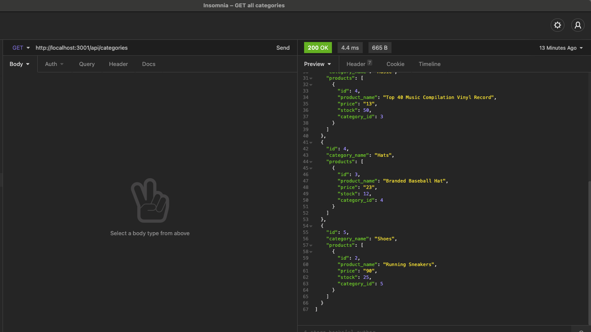

# E-commerce Back End

## Table of Contents
* [Description](#Description)
* [GitHub Repo](#GitHub)
* [Walkthrough Video](#Walkthrough)
* [Sample](#Sample)
* [Installation](#Installation)
* [Usage](#Usage)
* [LICENSE](#LICENSE)
* [CONTRIBUTING](#CONTRIBUTING)
* [Questions](#Questions)

## Description
Back end code using Express.js and Sequelize to manage a MySQL database of products, tags, and categories to present customers with a dynamic e-commerce experience.

## GitHub
https://github.com/hlry/ecommerce-backend

## Walkthrough

## Sample

## Installation
Clone this project from GitHub to your local machine.

Install mysql2.

To install dependencies, run the following in your Command Line Interface (e.g., Terminal or Bash):
- npm init
- npm install express mysql2 sequelize bcrypt dotenv

## Usage
Then run the following command in your CLI to start:
- node server.js

To seed the tables, run the following command:
- node seeds/index.js

To create the database open mysql2 in your CLI and run the following commands:
- mysql -u root -p
- source db/schema.sql

To exit:
- quit;

## LICENSE
This repository is licensed under the ISC License.
Refer to https://opensource.org/licenses/ISC for complete license terms.

## CONTRIBUTING
This project is not accepting contributions but if you send a pull request, it could be accepted under the terms of the Apache 2.0 license.

## Credits
Significant collaborators to this project are (or will be) listed here.

Initial project authored by hlry.

## Questions

If you have questions contact me on GitHub at [hlry](https://github.com/hlry).